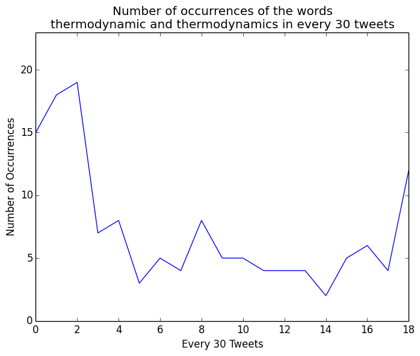

Coding Challenge
===========================================================

Language: Python 3.4.3

OS:       Mac OSX 10.10.4

## Additional Extensions Used

Matplotlib (and NumPy). Installation available [here](http://matplotlib.org/faq/installing_faq.html). All other modules used are part of the Python Standard Library.

## Summary of Approach

I have attempted to write a solution to this problem that would function for large sets of data, taking measures improve performance such as reading the tweets.txt file line-by-line and reading the input file only once.

I did a few things slightly differently to what was outlined in the challenge summary. I removed unwanted elements & characters, and added two additional outputs. The first additional output it a text file which lists the top 10 words used. The second additional output is a graph.

My motivation for creating a graph was that I was trying to think of the best way to visualize the data. I recalled Google’s Ngram Viewer and thought it would be interesting to implement something similar here. The first step to creating a graph was that I would need more data (tweets). Hence I added a stripped-down version of a project report that I had written at school to the original tweets.txt file, giving me around 560 ‘tweets’. The result of the plot is:

The plotted words can be changed by editing the inputs on the run.py script. 

Looking forward to your comments. Thanks.
